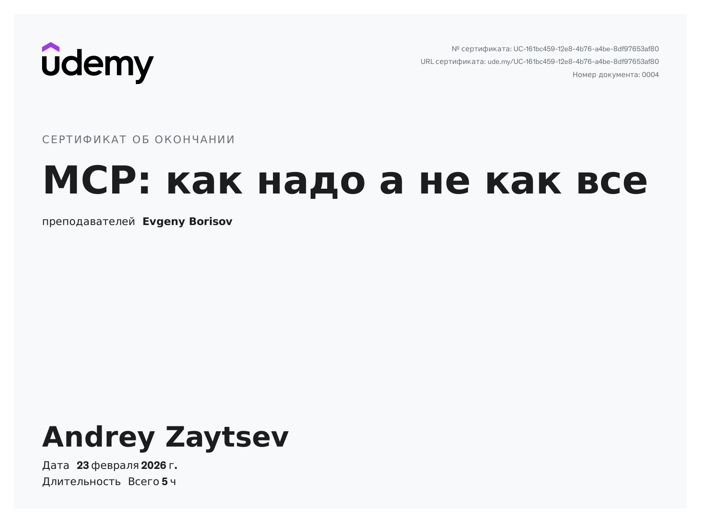

  <table border="0" cellpadding="0" cellspacing="0" width="100%">
    <tr>
      <td align="center" width="20%">
        
      </td>
      <td align="left" width="80%">
        

          Андрей Зайцев
        

        

          Senior Java Developer | Backend & SRE | Java + AI / LLM
        

      </td>
    </tr>
  </table>

---

## 👋 About me

Senior Java-разработчик, 6+ лет коммерческого опыта в backend и SRE.
Специализация: production-системы, производительность, надёжность, интеграция **LLM в enterprise-архитектуры**.

Основной фокус последних лет — **Java + AI**: LLM-интеграции в backend и developer tooling, Spring AI, RAG, memory, vector search, AI-агенты для инженерных процессов.

---

## 🧠 AI / LLM Focus

Spring AI (Pro) · RAG · Memory (PostgreSQL) · Reranker · Vector Search (OpenSearch) · Local LLM (Ollama) · Enterprise LLM (GigaChat) · AI-агенты и backend-интеграция

---

## 🛠 Tech Stack

**Backend**
- Java 8 / 11 / 17 / 21
- Spring, Spring Boot
- Spring Data, Web, WebFlux, Batch
- REST / gRPC / JAX-WS
- Hibernate, MyBatis

**Data**
- PostgreSQL
- Oracle (PL/SQL)

**DevOps / SRE**
- Docker, Kubernetes, Helm, OpenShift
- CI/CD: Jenkins
- Observability: Prometheus, Grafana, ELK
- SonarQube, JaCoCo
- SSO / JWT

**Performance**
- JVM profiling: JFR, JMC, VisualVM, JConsole
- Performance tuning and production troubleshooting

---

## 🚀 Key Experience

### Senior Backend Engineer (Java, SRE) — **Sber**
- Modernization of a core backend quality control system
- Java **8 → 21**, Spring → **Spring Boot 3 (Spring 6)**
- Migration from monolith to microservices
- Kubernetes adoption and team onboarding
- Oracle → PostgreSQL migration
- CI/CD, monitoring, test coverage recovery
- **Performance improvement: +30%**
- Technical leadership of a 4-developer team

---

## 🤖 Projects

### **LeaderOS** — AI-powered Tech Lead Framework · в опытной эксплуатации
Персональный фреймворк для автоматизации рутины технического лидера: 3 Java-микросервиса (Spring Boot 3, Java 21) + общая библиотека, оркестрируемые Claude AI агентом через MCP (14+ инструментов). Почта → классификация LLM → Intake Gateway → задачи/риски/инциденты; RAG-поиск по базе знаний (OpenSearch, автоиндексация), интеграции Jira/Confluence/Kubernetes, PostgreSQL, Docker.
👉 https://github.com/andreyznsk/Leader-Role-Framework

### **TestSmith** — Coverage-Driven Test Agent for IntelliJ IDEA
IntelliJ Platform Plugin (Java 17, Gradle) для coverage-driven генерации и анализа тестов, заложен как основа под **LLM-powered test automation**: модульная архитектура под JaCoCo-анализ покрытия, test selection policies и agent-based логику.
👉 https://github.com/andreyznsk/testSmith

### **AI Mail Agent** — LLM-powered Email Automation
Backend-сервис — AI-агент для анализа, классификации и генерации ответов на входящие письма, расширяемая архитектура под бизнес-правила.
👉 https://github.com/andreyznsk/AI_Mail_agent

### **Spring AI Chat with RAG & Memory**
AI-чат на **Spring AI** с memory (PostgreSQL), RAG, Reranker и Local LLM (Ollama); enterprise-адаптация на OpenSearch + GigaChat.
👉 https://github.com/andreyznsk/SpringAi_with_devOps

- Algorithm practice: https://leetcode.com/u/andreyznsk/

---

## 🎓 Education & Certifications

- Novosibirsk State Technical University — Computer Engineering
- GeekBrains — Java Developer
- **Spring AI Pro (2025)**
- **Udemy — Model Context Protocol (MCP)**

  

---

## 🌍 Languages
- Russian — Native
- English — Intermediate (B1)

---

## 📫 Contacts

- Email: andreyznsk@gmail.com
- LinkedIn: www.linkedin.com/in/andreyznsk
- GitHub: https://github.com/andreyznsk
